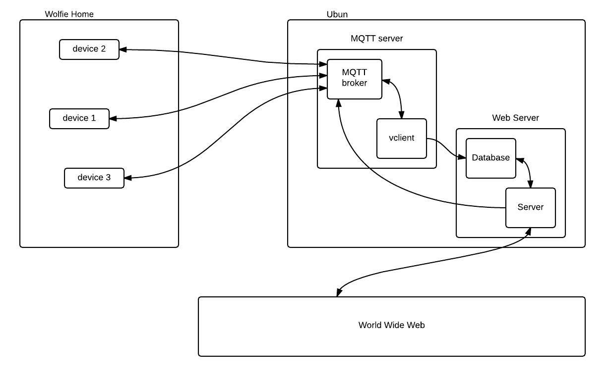

Design Document

version 0.0.3

Chaojie Wang

Bumsik Kim


**1 Purpose**
=============

This document is a technical design document. This document specifies components 
developers need to implement and how pieces work together. This should be used 
by developers as a reference for implementing Wolfie Home.


**2 Overview**
==============

There are three components in this project: microcontrollers that are able to 
connect to the Internet, a MQTT server, and a webserver with a database.

Microcontrollers communicate among each other with the MQTT server. Inside MQTT 
server, there are two components: one is MQTT broker, and the other one is 
called vclient. The MQTT broker handles the inter-communications among 
microcontrollers and vclient. The vclient is the virtual client that 
communicates with database and the webserver. The webserver communicates with 
users and the MQTT server. All communications are done with JSON format. We 
will use [JSON schema](http://json-schema.org/documentation.html) to specify 
the content of the data. They are stored in schema/ folder.

The following topology illustrates the idea:


**3 Concepts**
==============

**3.1 User model**
------------------

**3.2 Location model**
----------------------

**3.3 Device model**
--------------------


**4 Devices**
=============

**4.1 types of devices**
------------------------

In the table blow, “type” is used for topics of message. There are five types 
of modules: *security*, *environment\_sensing*, *speaker\_and\_led*, *battery*, 
*wireless*. These name should be

| Device | DataField | Data type                                                   | control? | Description                                                                                    |
|--------|-----------|-------------------------------------------------------------|----------|------------------------------------------------------------------------------------------------|
| SW     | switch    |Integer. 0 = off , 1 = on(triggered)                         |          | Generic switch (Can be pushbutton, reed magnet, PIR motion sensor etc. )                       |
| RCSW   | switch    |Integer. 0 = off , 1 = on(triggered)                         | O        | Generic remote controllable switch                                                             |
| Lux    | lux       |Integer. In lux                                              |          | Ambient light sensor                                                                           |
| Hum    | percent   |Integer. In percenatge (Max 100)                             |          | Humidity Sensor.                                                                               |
| Tmp    | degree    |Integer. In Celsius                                          |          | Contactless infrared temperature sensor                                                        |
| Baro   | pressure  |Integer                                                      |          | Barometric Pressure sensor                                                                     |
|        | altitude  |Integer                                                      |          | Altitude derived from pressure.                                                                |
| Light  | onoff     |Integer. 0 = led off, 1 = led on, 2 = blink                  | O        | Generic light switch.                                                                          |
|        | red       |Integer (max 255)                                            | O        | Color Led Red color. The module also sends data when this value updated by LED preset color    |
|        | green     |Integer (max 255)                                            | O        | Color led Green color. The module also sends data when this value updated by LED preset color  |
|        | blue      |Integer (max 255)                                            | O        | Color led blue color. The module also sends data when this value updated by LED preset color   |
|        | preset    |Integer. 0 = none, others = preset \# of colors              | O        | Number more than 0 indicates pre-defined color (e.g., 2 = RED, 3 = Violet....)                 |
| Spkr   | preset    |Integer. 0 = off, Else = preset of bells                     | O        | Speaker. Number more than 0 indicate pre-defined music stored in the SD card (1.wav, 2.wav...) |
| Batt   | percent   |Integer. 0 to 100                                            |          | Percentage of remaining battery                                                                |


**5 MQTT Communication**
========================

Both the web server and the MQTTserver are running on a Linux computer.

**5.1 MQTT broker**
-------------------

The MQTT broker is implemented according to MQTT protocol. There is an open 
source MQTT broker called `mosquitto` ([homepage link](https://mosquitto.org/)), which is used in this project.


**5.2 Communication among device modules**
------------------------------------------

for both obtaining data and control device modules, we use following topic 
format: 

```
dev_api/<user>/<location>/<device>
```

The role of this topic is just addressing 
modules. If all fields are specified, the addressing is unique.

| field    | description                                                      |
|----------|------------------------------------------------------------------|
| user     | Name of user (i.e. John).                                        |
| location | Name of location. It could be either building name or room name  |
| device   | Name of device (can be one described in section 3.1.             |

The complexity of communication lies in the payload. The payload is JSON 
formatted. The schema of the JSON format is specified in [payload.json](schema/payload.json).


**5.3 Obtaining house information**
-----------------------------------

We need a topic for obtaining general information about the house. This help a 
new module makes sense of the existing system and for webserver know the house 
better. The topic format is:

```
Info/(house)
```

**5.4 vclient**
---------------

`Moquitto` also provides library for writing MQTT client. It is used for writing 
vclient. vclient is short for virtual client. vclient is responsible for 
obtaining all status data from device modules and store them into the database. 
See 5.1 for specific data that we need to save.


**6 Web Application**
=====================


**6.1 MySQL**
-------------

The database vendor is MySQL. Use account *chaojie*, and password *dummypass* 
to login. The MySQL has a database called *wolfie\_home*. *wolfie\_home* has 
two table: *users* and *house*.

There is a *users* table. It stores information about users and their house 
information.

| COLUMN NAME | SQL TYPE     | DESCRIPTION                   |
|-------------|--------------|-------------------------------|
| uid         | INT          | Unique identifier of the user |
| username    | VARCHAR(128) | Username                      |
| password    | VARCHAR(128) | Password                      |
| email       | VARCHAR(128) | Email                         |
| house\_info | JSON         | House information.            |

Each user has a *house* table. The table stores status of all device modules 
in a user’s house. Data stores in a *house* table are generated by vclient. 
house\_info is a JSON of house\_info.json schema.

| COLUMN NAME  | SQL TYPE     | DESCRIPTION                                                    |
|--------------|--------------|----------------------------------------------------------------|
| house        | VARCHAR(128) | House name, it is unique.                                      |
| uid          | VARCHAR(128) | Unique identifier of the device.                               |
| module       | VARCHAR(128) | Module type. one of predefined module types sect 3.1.          |
| mod\_content | JSON         | Content of a device module. One of the device modules content. |
| time         | TIMESTAMP    | Time the value was recorded.                                   |


**6.2 Server**
--------------

When a user log in, the web server queries data from *wolfie\_home* table, 
and display to the user. It also accepts HTTP request from user to control 
devices module.


**6.2.1 Backends**
------------------

The job of backend is to interact with the MYSQL database and MQTT server on 
behalf of users. It has following urls: api/login, api/logout, api/house, 
api/control, api/module

-   login: verify login information of a user. If it is verified, a cookie is 
sent to identify user. The cookie is the username.

-   logout: destroy the cookie.

-   devices: query information about devices

-   control: controlling

API specifications:

-   login: AJAX with POST, with fields *username* and *password*. Each field is 
type of string. On success, status code is 301 Moved Permanently. On failure, 
status code is 400 Bad Request. For example, a user can send AJAX with POST 
method: username=jack, password:123456.

-   logout: AJAX with POST, with no fields. On success, status code is 200 OK. 
On failure, status code is 400 Bad Request.

-   house: AJAX with POST, with no fields. On success, status code is 200 OK, 
and field *house\_info*, a JSON data with schema house\_info.json is returned. 
On failure, status code is 400 Bad Request.

-   module: AJAX with POST. It has fields *command*, *module\_uids* and 
*modules*. There are two *command*:

| command             | quick description                                  |
|---------------------|----------------------------------------------------|
| get\_module\_recent | Get the most recent data about one or more modules |
| get\_module\_all    | Get all data about one or more modules             |

The *module\_uids* is a list of one or more module uids that are separated 
by commas.
The *modules* is a list of one or more module names that are separated 
by commas.
Same index of *module\_uids* and *modules* are together to identify a module. 
On success, the status code is 200 OK, the data is JSON with modules\_data.json 
schema.

On failure, the status code is 400 Bad Request, the body has a JSON object:

{“error\_code”: integer, “error\_msg”: string}. error\_code 1 means failing 
completed, and error\_code 2 means partially finished(might need more elaborations)…

-   control: AJAX with POST. It has fields topic and payload, which are the 
same in section 4.2. On success, the status code is 200 OK, otherwise it is 
400 BAD Request.


**7 Security**
==============

Security is very important in this project. To be filled.
